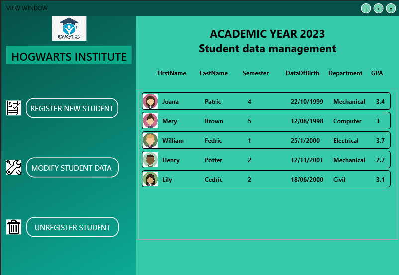
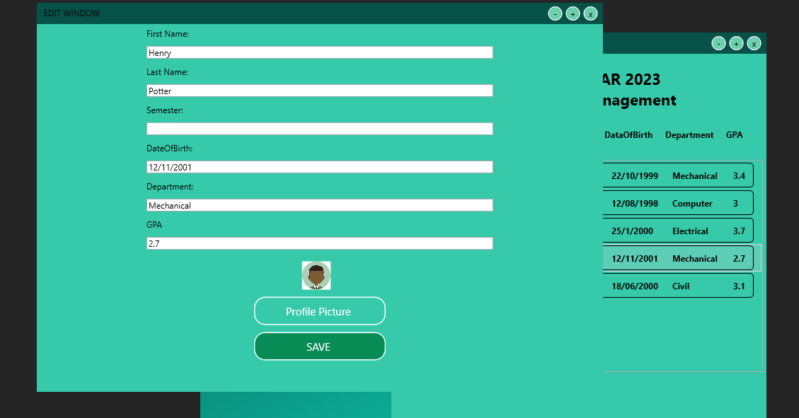

# Student Registration System Admin GUI

The Student Registration System Admin GUI is a WPF application designed to provide administrators with an intuitive interface for managing student records. This system allows administrators to register new students, modify existing student information, and delete student records from the management system.

## Features

- **Admin Dashboard:**
  - Overview of student records and management options.

- **CRUD Operations:**
  - *Register:* Add new students to the system.
  - *Modify:* Update existing student information.
  - *Delete:* Remove student records from the management system.

## Technologies Used

- C# WPF (Windows Presentation Foundation)
- MVVM (Model-View-ViewModel) Architecture

## Screenshots

